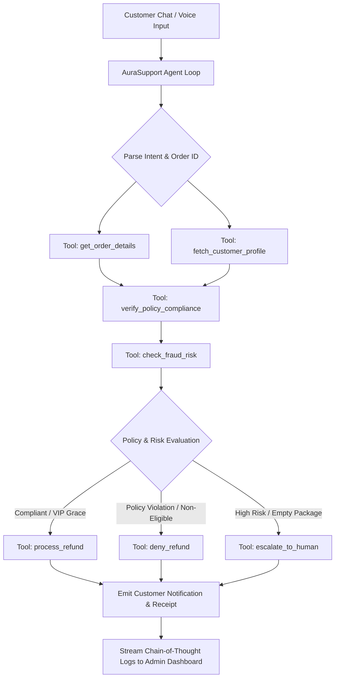

# AuraSupport — Autonomous AI E-Commerce Refund Agent

A fully functional, production-ready web application featuring an **AI Customer Support Agent** that processes or denies e-commerce refund requests using autonomous tool calling, strict policy rule verification, a 15-customer CRM database, a real-time admin reasoning dashboard, and an interactive voice pipeline.

---

## 🌟 Key Features & Highlights

- 🤖 **Autonomous Multi-Step Agent Loop**: Formulates reasoning thoughts, dynamically calls tools, evaluates rule constraints, and executes refund actions.
- 🗄️ **Mock CRM Database (15 Profiles)**: Complete customer registry with tiers (`VIP`, `Gold`, `Standard`, `High-Risk`), lifetime spend, return rate metrics, and fraud risk scores ($0 - 100$).
- 📜 **Strict Policy Verification Engine**: Evaluates 30-day return windows, item conditions, digital download exclusions, hygiene regulations, and tiered VIP grace period overrides.
- 🎙️ **Interactive Voice Pipeline**: Browser-native Speech-to-Text (Microphone STT) and Speech Synthesis (TTS) with active audio wave visualization.
- 📊 **Admin Reasoning Dashboard**: Real-time Chain-of-Thought log feed displaying every `Thought`, `Tool Action`, `Input Args`, `Output Result`, execution duration, and policy receipt.
- ⚡ **1-Click Demo Presets**: Test standard approvals, policy violation denials, VIP edge cases, and high-risk fraud escalations instantly.

---

## 🏗️ System Architecture & Tool Orchestration



### Registered Agent Tools
1. `get_order_details(orderId)`: Retrieves purchase date, delivery date, item condition, digital status, and total amount.
2. `fetch_customer_profile(customerId)`: Queries CRM record for tier (`VIP`, `Gold`, `Standard`, `High-Risk`), lifetime value, return rate, and fraud risk score.
3. `verify_policy_compliance(orderId)`: Checks return window timeline, original packaging, tag status, digital product exclusions, and VIP/Gold grace extensions.
4. `check_fraud_risk(customerId)`: Evaluates risk score, abnormal return rate flags, and past refund history.
5. `process_refund(orderId, amount, justification)`: Issues credit receipt, updates audit log, and generates customer confirmation message.
6. `deny_refund(orderId, violationReasons)`: Generates formal policy rejection receipt with bulleted violation rationale.
7. `escalate_to_human(orderId, escalationReason)`: Flags session for manual audit by Human Fraud Investigation Security team.

---

## 🗃️ Mock CRM Database Overview (15 Profiles)

| Customer ID | Name | Tier | Lifetime Spend | Return Rate | Risk Score | Test Scenario |
| :--- | :--- | :--- | :--- | :--- | :--- | :--- |
| `CUST-1001` | **Sarah Jenkins** | VIP | $14,500 | 2% | 5 | **Standard Approved Refund** (Unopened ANC Headphones, Day 12) |
| `CUST-1002` | **Marcus Vance** | High-Risk | $420 | 82% | 88 | **Fraud Violation Denial** (Damaged leather jacket, tags removed) |
| `CUST-1003` | **Elena Rostova** | Standard | $1,200 | 10% | 15 | **Digital License Denial** (Pro Studio Audio DAW key) |
| `CUST-1004` | **David Kim** | VIP | $28,000 | 4% | 8 | **VIP Grace Edge Case** (Desk Chair delivered 32 days ago - 5-day grace applied) |
| `CUST-1005` | **Aisha Sharma** | Gold | $6,100 | 12% | 12 | **Shipping Damage Approval** (OLED Smartwatch broken on arrival) |
| `CUST-1006` | **Liam O'Connor** | Standard | $650 | 15% | 35 | **Expired Window Denial** (Keyboard delivered 48 days ago) |
| `CUST-1007` | **Zoe Chen** | Gold | $8,900 | 8% | 10 | **Approved** (Cashmere coat unopened, Day 14) |
| `CUST-1008` | **Devon Miller** | High-Risk | $180 | 75% | 92 | **Human Escalation** (Empty package claim on high-risk account) |
| `CUST-1009` | **Sophia Martinez** | Standard | $2,400 | 9% | 18 | **Approved** (4K Monitor unopened, Day 25) |
| `CUST-1010` | **James Wilson** | Standard | $980 | 22% | 45 | **Hygiene Denial** (Used espresso machine missing packaging) |
| `CUST-1011` | **Amara Okafor** | VIP | $19,200 | 3% | 4 | **Approved** (Luxury Tote Bag, Day 20) |
| `CUST-1012` | **Lucas Dubois** | Gold | $4,800 | 14% | 20 | **Approved** (Smart Home Controller, Day 15) |
| `CUST-1013` | **Maya Patel** | High-Risk | $310 | 68% | 81 | **Hygiene Exclusion Denial** (Opened cosmetics bundle) |
| `CUST-1014` | **Benjamin Taylor** | Standard | $1,550 | 6% | 14 | **Approved** (Bluetooth Speaker, Day 29) |
| `CUST-1015` | **Chloe Dupont** | Gold | $5,400 | 7% | 11 | **Gold Grace Approved** (Graphic Tablet, Day 31 - 3-day grace applied) |

---

## 📹 Loom / Google Drive Video Presentation Script (7-10 Minutes)

Use this script structure for your video walkthrough submission:

### 1. Introduction & Architecture (0:00 - 1:30)
- Introduce **AuraSupport**: Explain how the autonomous agent engine uses tool calling to parse refund intent, fetch CRM profiles, check policy guardrails, and execute refund transactions.
- Highlight the **15 Customer CRM Database**, **Strict Refund Policy Engine**, and **Web Speech Voice Integration**.

### 2. Live Demo: Standard Approved Refund (1:30 - 3:30)
- Select the **"Standard Approved Refund"** preset (Sarah Jenkins, `ORD-8821`).
- Submit request: *"Hi, I bought the UltraNoise ANC Headphones. Box is unopened and delivered 12 days ago."*
- Show the agent response and green **APPROVED** receipt badge.
- Switch to **Admin Reasoning Logs** tab: Show the step-by-step chain-of-thought (`get_order_details` $\rightarrow$ `fetch_customer_profile` $\rightarrow$ `verify_policy_compliance` $\rightarrow$ `process_refund`).

### 3. Live Demo: Policy Violation Denial & Edge Cases (3:30 - 6:00)
- **Digital Product Denial**: Click **"Digital License Denial"** preset (Elena Rostova, `ORD-7740`). Demonstrate how the agent identifies Rule 202 (Digital products non-refundable) and issues a red **DENIED** receipt.
- **VIP Grace Overriding Edge Case**: Click **"VIP Overriding Edge Case"** preset (David Kim, `ORD-6402`). Explain how the item is 32 days old (exceeds standard 30-day window), but Rule 401 VIP Grace applies due to $28k spend and low risk score.
- **High-Risk Fraud Denial**: Click **"High-Risk Fraud Denial"** preset (Marcus Vance, `ORD-9104`). Demonstrate how missing tags, item damage, and an 82% return rate trigger an automatic denial.

### 4. Live Demo: Interactive Voice Pipeline (6:00 - 7:30)
- Click the **Microphone Button** in the chat input.
- Speak a query: *"Can I return my order ORD-8821?"*
- Demonstrate the **live canvas soundwave visualizer** during recording and the agent's text-to-speech voice response.

### 5. Code Walkthrough & Reasoning Logs (7:30 - 10:00)
- Walk through `src/agent/agentEngine.ts` (multi-step loop logic), `src/agent/tools.ts` (tool implementations), and `src/data/refundPolicy.ts` (rule sets).
- Demonstrate copying the raw JSON logs feed from the Admin Dashboard for auditing.

---

## 🚀 Quick Start Guide (Running Locally)

### Prerequisites
- **Node.js**: v18.0.0 or higher
- **npm**: v9.0.0 or higher

### Steps

1. **Clone the repository**:
   ```bash
   git clone https://github.com/your-username/ai-refund-agent.git
   cd ai-refund-agent
   ```

2. **Install dependencies**:
   ```bash
   npm install
   ```

3. **Start local development server**:
   ```bash
   npm run dev
   ```
   Open `http://localhost:3000` in your web browser.

4. **Build production bundle**:
   ```bash
   npm run build
   ```

---

## 📁 Repository Structure

```
.
├── index.html                  # HTML entry point with fonts & metadata
├── package.json                # Project dependencies & scripts
├── vite.config.ts              # Vite configuration
├── tailwind.config.js          # Custom theme configuration
├── README.md                   # Complete documentation & video script
└── src/
    ├── main.tsx                # React root mount point
    ├── App.tsx                 # Tab router & state manager
    ├── index.css               # Design system & custom animations
    ├── agent/
    │   ├── types.ts            # Interfaces for CRM, orders, logs & decisions
    │   ├── tools.ts            # Registered agent tool implementations
    │   └── agentEngine.ts      # Dynamic step-by-step reasoning engine
    ├── data/
    │   ├── crmData.ts          # 15 Customer profiles & scenario presets
    │   └── refundPolicy.ts     # Strict refund policy rules & markdown doc
    ├── voice/
    │   └── useVoicePipeline.ts # Web Speech API (STT & TTS) custom hook
    └── components/
        ├── Header.tsx          # Navigation header & status bar
        ├── CustomerPortal.tsx  # Customer chat, scenario presets & mic control
        ├── AdminDashboard.tsx  # Chain-of-Thought logs, KPIs & JSON export
        ├── CrmInspector.tsx    # Filterable 15 customer profile browser
        ├── PolicyViewer.tsx   # Policy rules & markdown inspector
        ├── VoiceVisualizer.tsx # Active soundwave visualizer
        └── LoomGuideModal.tsx  # Video recording script modal
```

---

## 📄 License
MIT License. Created for AI Customer Support Agent Evaluation.
